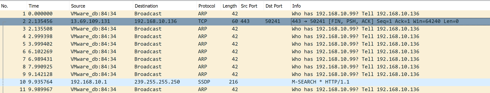

# STANDCON CTF Write Up

Initial ARP messages tell you that there is clearly no 192.168.10.99 available. This should give some signal that the connection is not happening.

Suddenly, there’s another ARP message appearing which redirects the target to it (now a new player with 192.168.10.145)

The moment there’s some connection, it’s trying to reach to n0h4ts

ICMP showing that the man-in-the-middle is allowing connection to internet.

Notice there’s an HTTP clear text get from the IP address.

Bleah I didn’t close the bloody HTML and body. But the encoded message is there.

Flag is in the decoding.
