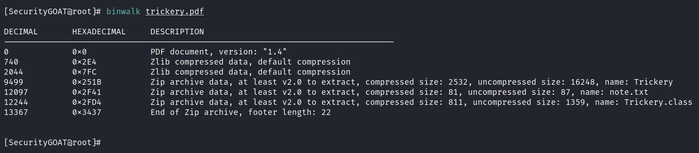
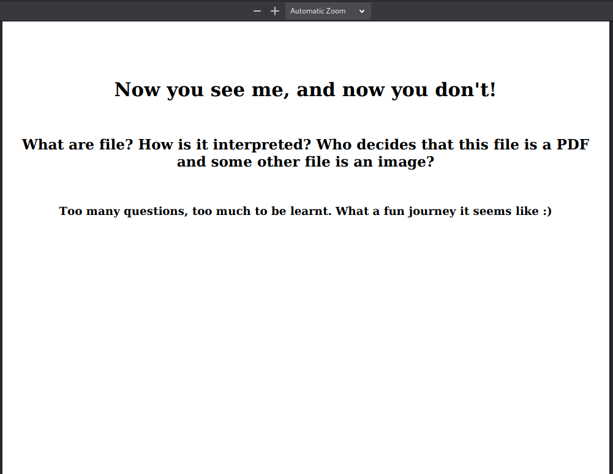
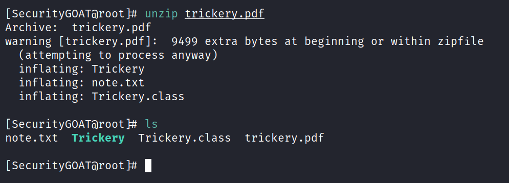
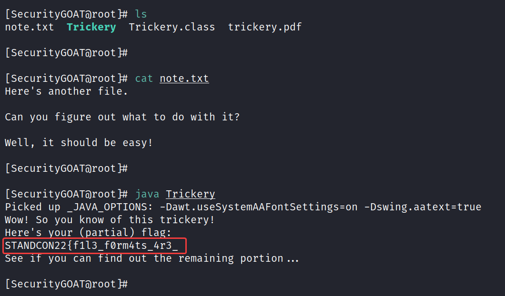
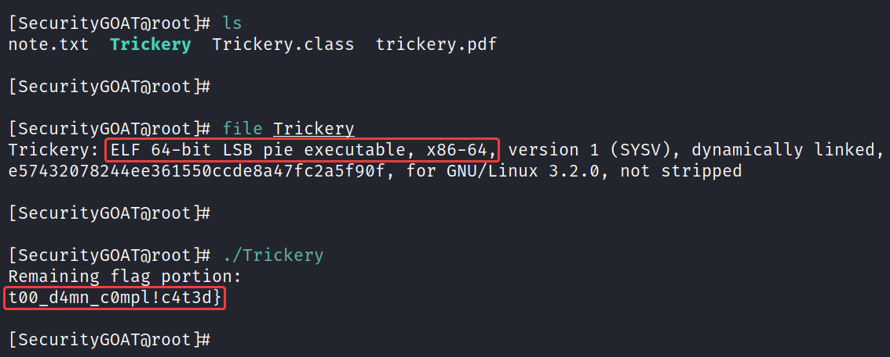

# Walks like a cat, barks like a dog

**Author:** SecurityGOAT  

## Category
Miscellaneous

## Question
> What makes Zebra, a Zebra?  
> What makes Cow, a Cow?  
> What makes Dog, a Dog?  
> These are some tough questions.  
> What's more tough is what makes a PDF file, a PDF?  
> And what makes a PNG file, a PNG?  
> I suppose only you can answer that.  

## Hints

1. In Bible it says "Ask, and it shall be given to you". Try asking the file?
2. Talk to the file. Maybe it is multilingual.

## Solution

The provided PDF file is a polyglot file. It can be extracted as a Zip file (which can be identified using **binwalk**).  

Extracting it as a Zip archive gets back more files. Important ones are:
- **.class** file
- **ELF** binary

Running them reveals parts of flags which can be combined to get the complete flag.  

### Detailed Solution

The provided PDF is a polyglot file. That could easily be confirmed using binwalk:  

Open the PDF file in the browser:  

Try extracting files using **unzip**:  

All went well.

Notice the extracted files. There is a **.class** file. Try running it:  

That reveals the partial flag:  

**First half of the flag:** STANDCON22{f1l3_f0rm4ts_4r3_  

There is one more file named **Trickery**. It's a 64-bit Linux executable (ELF) file.  

Run it and see what comes back:  

It spits back the remaining portion of the flag:  

**Second half of the flag:** t00_d4mn_c0mpl!c4t3d}  

## Flag

STANDCON22{f1l3_f0rm4ts_4r3_t00_d4mn_c0mpl!c4t3d}