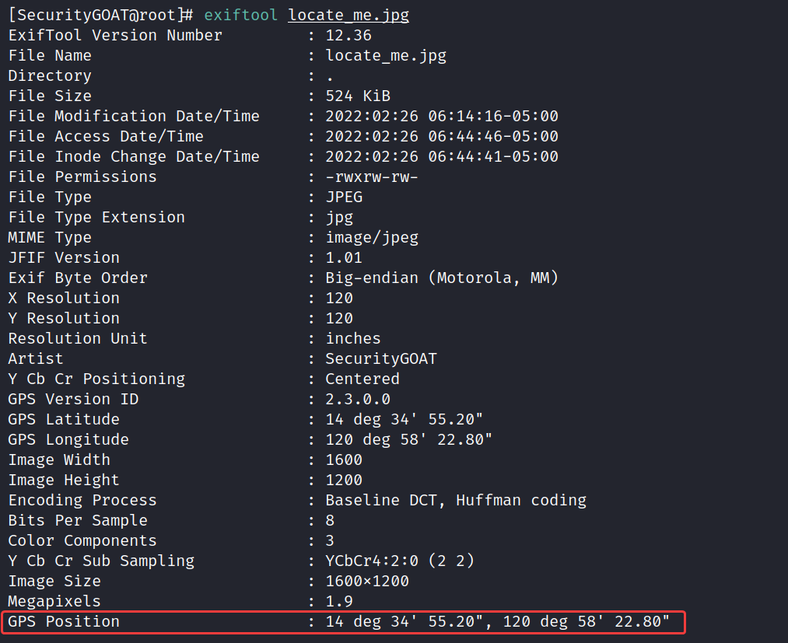
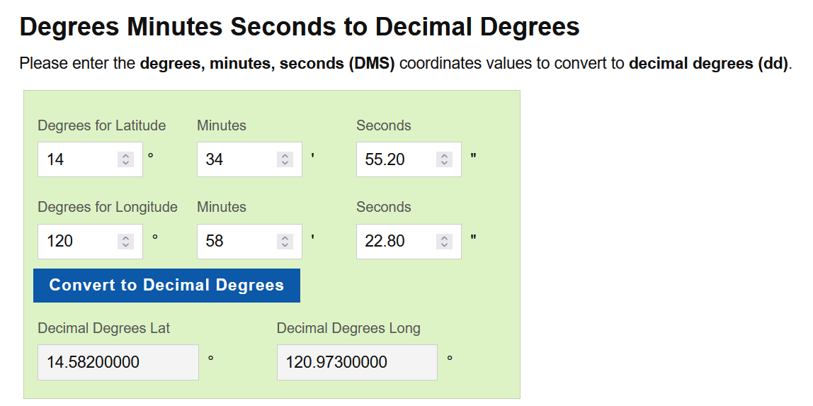
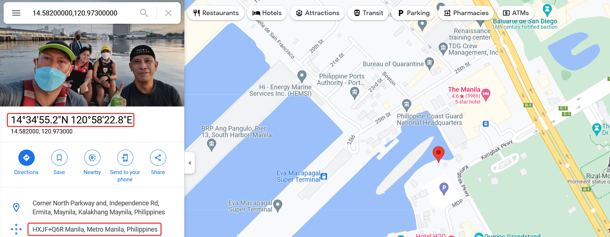
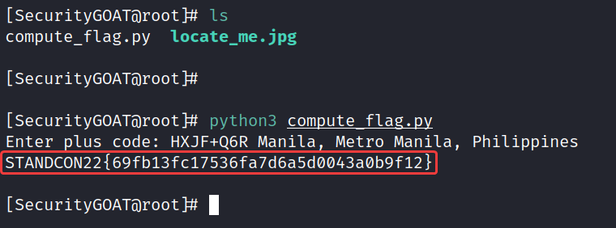

# Locate Me

**Author:** SecurityGOAT

## Category

OSINT

## Question

> Sherlock is investigating a kidnapping case and managed to retrieve an image from the hard drive of a suspect.  
> Could you help Sherlock find the location from this image?  
> Once the location is determined, supply the [**Plus Code**](https://maps.google.com/pluscodes/) to the `compute_flag.py` script and retrieve the flag.  

## Hints

1. Ask the image and it shall answer you back.
2. No wonder the data about the data could be too revealing.

## Solution

The van in the image has a Philipines Navy label which already indicates its somewhere in Philipines.  

Using exiftool, the metadata of the image can be retrieved and that contains the lat-long values.

### Detailed Solution

Get the metadata using `exiftool`:  

Convert the location to standard coordinates (in degrees):  

**Reference:** https://www.latlong.net/degrees-minutes-seconds-to-decimal-degrees  

Search for the location in Google Maps:  

**Plus Code:** HXJF+Q6R Manila, Metro Manila, Philippines  

Pass the plus code to the provided Python script:  

## Flag
STANDCON22{69fb13fc17536fa7d6a5d0043a0b9f12}