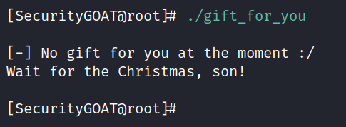

# Wait for the day

**Author:** SecurityGOAT

## Category
Reversing

## Question
> Momma bought a Christmas gift for you. She says it's something you love!  
> But Christmas is like more than 6 months away :/  
> Try to peek in and find out what the gift is, before the Christmas eve ;)  

## Solution

The binary contains three hurdles to overcome. One is the date check. That could be overcome by placing a breakpoint and tampering the register values inside GDB. Then there is a global variable that must be set to a specific value. This is also to be tampered in GDB. The gift memory location is revealed after these two steps. So a breakpoint must be placed to prevent the program from exiting and the flag can then be read from the process memory.  

### Detailed Solution

Execute the provided binary:  

There must be some checks that avoid us accessing some functionality that this binary offers.  

Checking the library calls made by this binary using **ltrace**:  

There's a call to **time(0)**. So the binary checks the current time, and probaly compares with it some other time (maybe that's what *wait for the christmas* meant).  

Open the binary in **GDB**:  

Two interesting functions are present inside main:  
- time_check
- dispatch_gift

**Disassemble time_check function:**

Notice the function compares the provided argument to an epoch value.  

It's Christmas eve!  

Place a breakpoint after the **cmp** instruction and run the binary inside GDB:  

Move to the next instruction (to determine which branch gets taken after the **jmp** instruction):  

Just before we return, let's set the **eax** register to 0 so that the **main** function thinks it was a success!  

That didn't work out well! Lets find out why:  

There's one more **cmp** after **time_check** function, probably that prevented us from getting to the **dispatch_gift** function. Let's fulfill that check:  

This time it worked - the gift was dispatched and is in memory. But since we didn't had any breakpoint after **dispatch_gift** function, the program exited and we cannot access the provided memory address!  

To fix that, we can place a breakpoint at the end of the **main** function:  

Don't forget to fix the registers and memory addresses:  

Let's grab the flag now:  

## Flag
STANDCON22{!ts_4lw4ys_4_g00d_t!me}