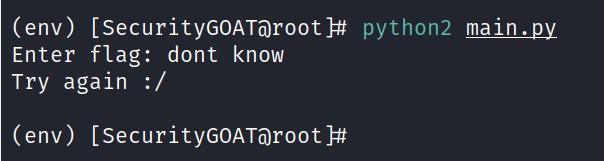
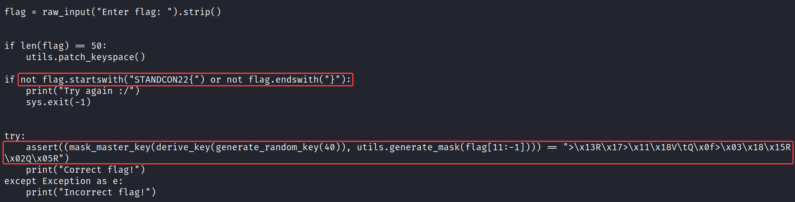
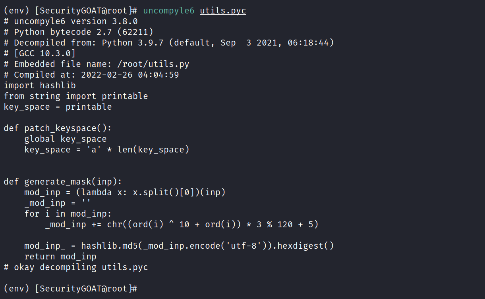

# Want a byte?

**Author:** SecurityGOAT  

## Category
Reversing

## Question
> Scrolling through my projects, I found some old project code.  
> I remember this code had some "backdoors". But since I mistakenly deleted `utils.py`, now I cannot understand my own code!  
> Can you help me make sense out of it?  
> You will be rewarded with a flag for your help.  

## Hints

1. Python bytecode has all the information to get back the code.
2. Consider *uncompyl*ing the code.

## Solution

The challenge is focused on understanding the provided Python code. The Python code in **utils.pyc** file can be retrieved using the **uncompyle6** utility.  

Then the task would be to understand the code. Analyzing the code closely, it actually unfolds to something easier:  

- The **utils.patch_keyspace()** function would patch the keyspace and set it to all **a**'s. This is called even if the flag length is not 50.  

- **generate_random_key()** function would return a string of 40 **a**'s.  

- In the **derive_key()** function, **sub_key_1** and **sub_key_2** variables would hold 20 **a**'s each. The master key would be 20 **a**'s.  

- The **mask_master_key()** function takes a bitwise XOR of the master key and the flag substring (the string between `STANDON22{...}`).  

- The **generate_mask()** function is effectively the identity function sicne flag doesn't have any spaces.  

- The XOR value is compared to a hardcoded string. In the equation `a ^ b = c`, we know `b` and `c`. To find `a`, we need to do: `a = b ^ c`.  

### Detailed Solution

Run the **main.py** script:  

It expects the flag as the input.  

Since we don't know the flag, it tells us to try again!  

Check the last part of the **main.py** script:  

Notice the highlighted code parts.  

Seems like flag of length 50 activates some code path (but this is a rabit hole). Actually, **utils.patch_keyspace()** is called anyways, so the flag of length 50 is not required at all. Then some checks are made and if everything goes well, that means the supplied flag was correct. A usual check is there to ensure the flag is of the format `STANDCON22{...}`.  

Uncompyle the code using **uncompyle6** utility:  

Now we have the code. All we need to do is analyze it and it can be seen that this seemingly complex code is actually quite simple. All that is needed is some patience!  

## Solution Script

[solution.py](solve/solve.py)

## Flag
STANDCON22{_r3v_py7h0n_byt3c0d3}