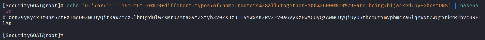

# eXtreme Injections

**Author:** SecurityGOAT

## Category

Web

## Question

> I have curated a set of interesting infosec posts and built and API to serve you these, securely. Everything is so minimal and secure that there is no chance of attacks! Feel free to try your luck ;)

## Hints

1. Classic *seqels* are fun!
2. The odds are *stacked* against you. Feel free to leave now.

## Solution

The application is vulnerable to SQLi. Since stacked queries are enabled (mentioned in hints), and the database can be identified using SQLi (it is SQLite), the attacker's public SSH key can be uploaded to the **authorized_keys** file to gain root access.  

### Detailed Solution

Scan the target machine:  

SSH and a web server are available on the target machine.  

See what's there on the web server:  

There are a lot of infosec posts!  

Check one of them:  

Notice the URL at the bottom of the screen in the above screenshot.  

Looks like base64 encoded value. Decode it:  

Set the **u** parameter to single quote (**'**) and see if things still work the same (we are trying SQLi stuff...):  

Internal server error:  

That might mean SQLi, or maybe not. Let's confirm:  

Modify the payload in the **u** parameter to **' or '1'='1**:  

Some post did show up, so SQLi did work!  

Now try more SQLi foo and identify the *select* column count:  

At 6th column, we get internal server error, so there are 5 columns!  

We don't know which db is used, let's start with **sqlite**, and we can move forth to others if its not used:  

Well it did work but no info was given out by the database.  

We can try to add our SSH key to the server provided that stacked queries are enabled and we have write permissions to the SSH directory:  

We got an internal server error while uploading our SSH key. Did it work? Let's find out:  

Yes it did! And we got the flag too!!

## Flag
STANDCON22{sql!t3_!nj3ct!0n5_4_th3_w!n}

# Other Writeups
- https://dame-dango.github.io/STANDCON2022/Extreme%20Injections/