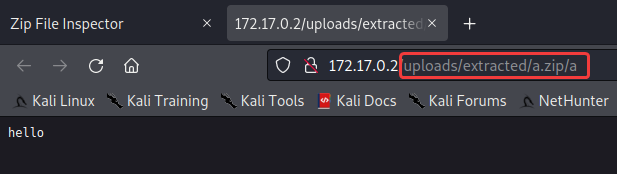

# Files can Slip too

**Author:** SecurityGOAT

## Category

Web

## Question

> Files say a lot and can do a lot, but did you knew that files can slip too? Provided the surface is slippery enough.  

## Hints

1. Can a make a Zip archive with relative file paths?
2. What happens if the server extracts files with relative paths? Can the extracted files somehow *slip* the file upload directory?

## Solution

Upload a zip archive with relative path to add the **evil.php** file in the webroot directory.  

**Note:** Challenge has been updated and the flag file is now located at: **flag_022dc5a58d33**.  

### Detailed Solution

Uploading a zip file containing one file:  

The file is extracted:  

Open the extracted file:  

It is extracted in the following path: **uploads/extracted/<zip_file_name>/<file_name>**.  

Create a malicious zip archive with a PHP webshell that has a relative path containing 3 **../** sequences to jump out of the created directory structure:  

Upload this malicious zip archive:  

Zip file is uploaded and extracted:  

Open link to the extracted **evil.php** file:  

The page works. Send a shell command:  

Webshell is successfully uploaded!  

Get the flag:  

## Flag
STANDCON22{uns4f3_z!p_3xtr4c7!0n_!5_4_r34l_d4ng3r}