# Maze Repo

**Author:** SecurityGOAT

## Category

Web

## Description

> You are about to witness a repository that has more than it meets the eye!  
> Some think it as a maze but I would say it's the *mirror* that deceives you the most :)  

## Hints

1. Can a repo bleed?
2. A mirror shows more than your clone!

## Solution

This lab is based on the GitBleed CVE (CVE-2022-24975).  

**Reference:** https://wwws.nightwatchcybersecurity.com/2022/02/11/gitbleed/  

### Steps

1. Scan the target (`nmap`).
2. Discover `/backups` and `/backups/.git` directories (`dirb`).
3. Notice the git config file and mirror the git repository (`git clone --mirror http://server/projects/leaking-repo`).
4. Analyze the commit history of the mirrored repository:
   - `git log --graph --all -p` (Commit logs [even for deleted branch])
   - `git rev-list --objects --all` (List of objects along with the names -- ends up showing the users.db file is modified in 3 commits)
5. Clone from the mirrored repository to get a working tree and pull the deleted file. (`git clone mirrored_repo cloned_repo`)
6. Recover credentials (hashes) from the sqlite db. (`select * from login;`)
7. Crack the credentials (using JTR). (Crack the hash for the admin user -- `michael`)
8. Login to the webapp using admin's credentials and grab the flag. (`michael:halloween`)

## Detailed Solution

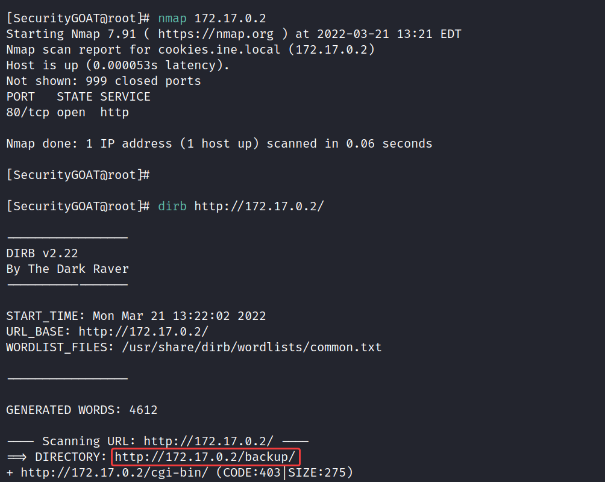

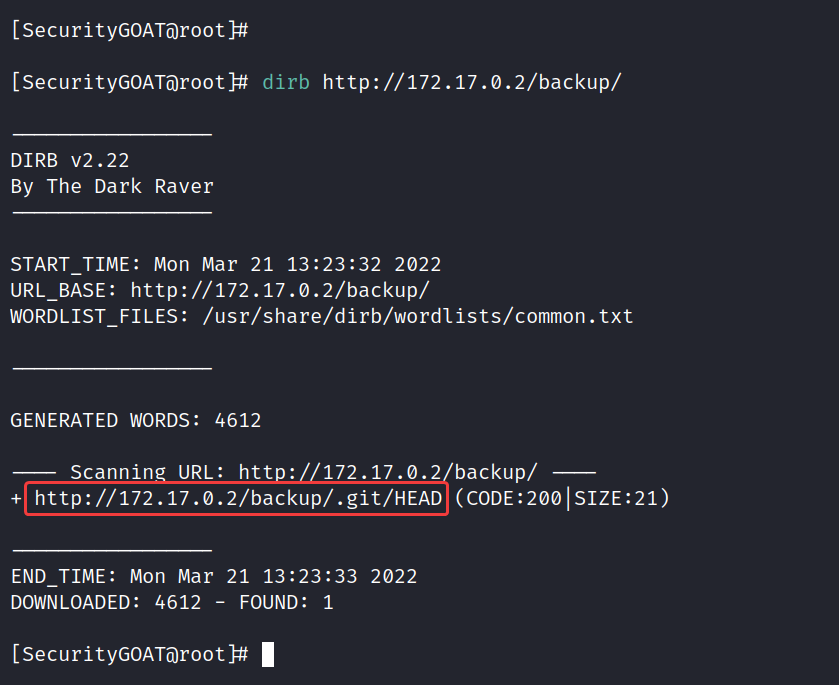

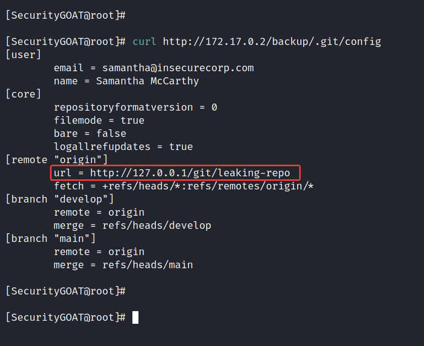

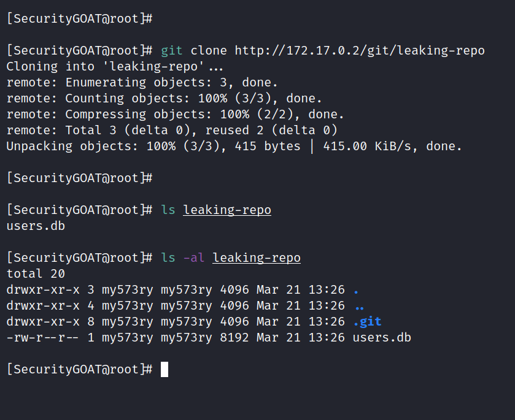

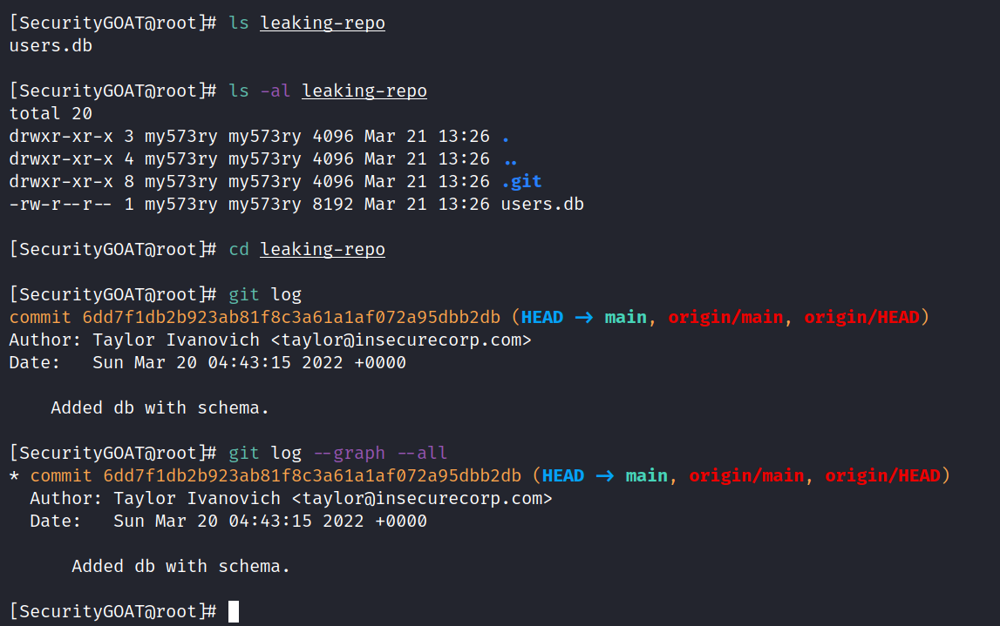

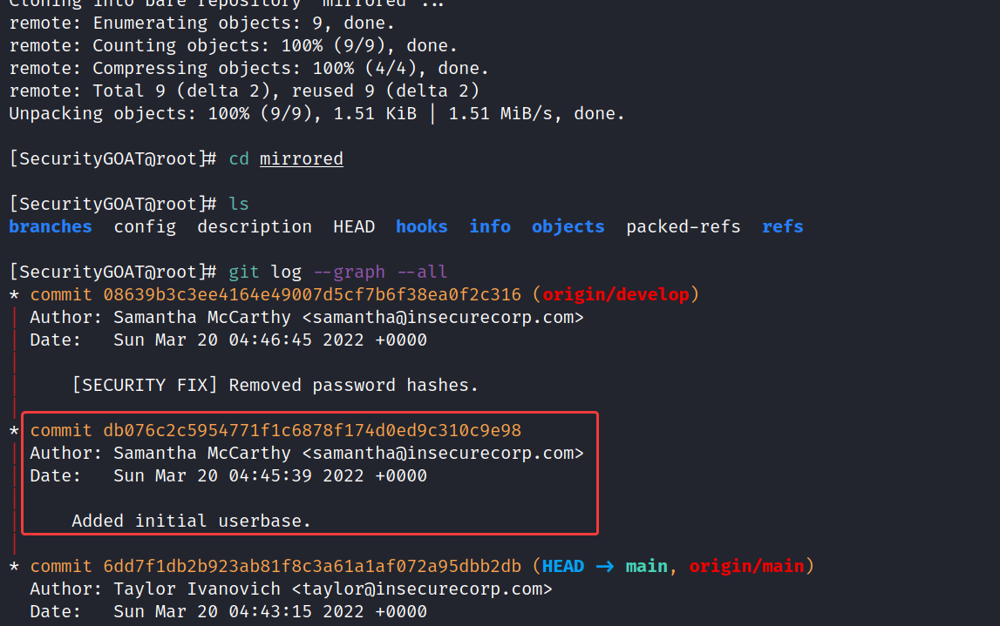

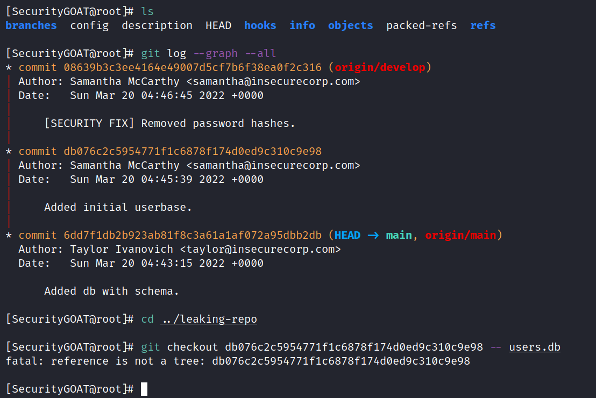

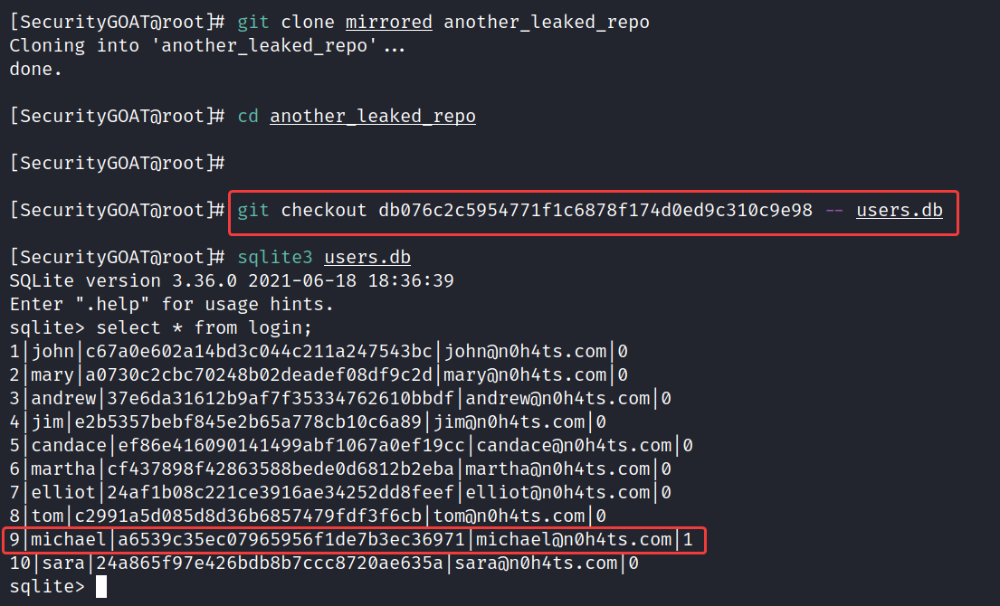

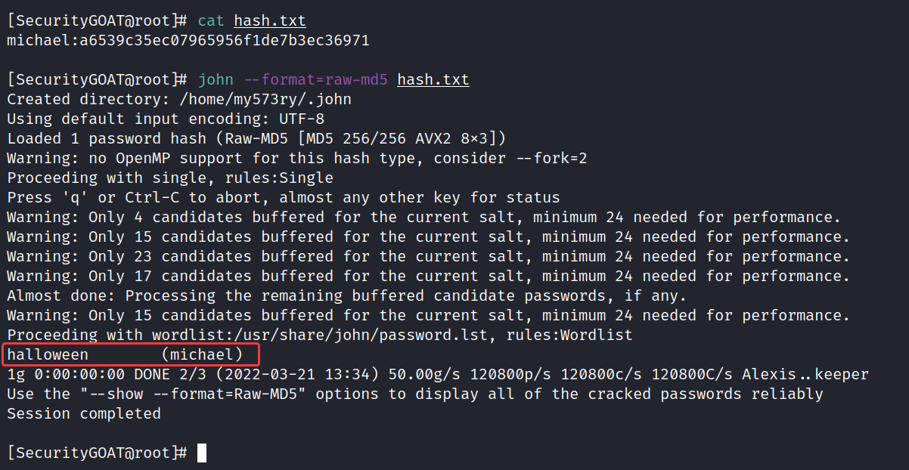

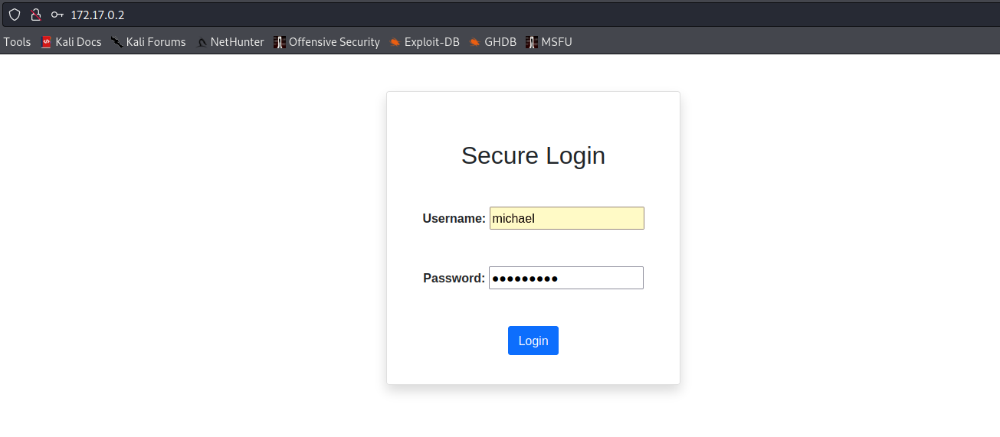

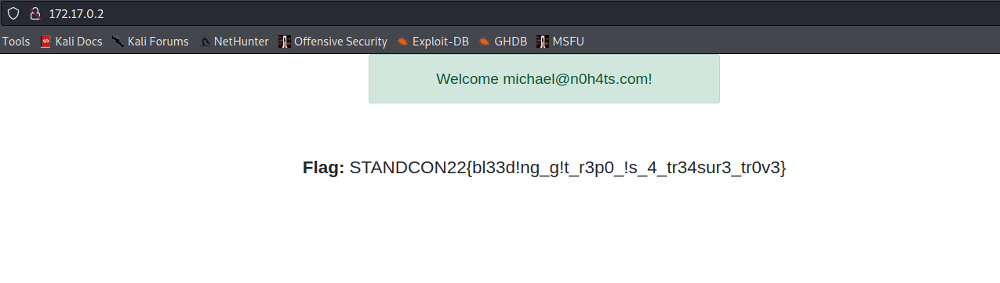

### Flag

STANDCON22{bl33d!ng_g!t_r3p0_!s_4_tr34sur3_tr0v3}