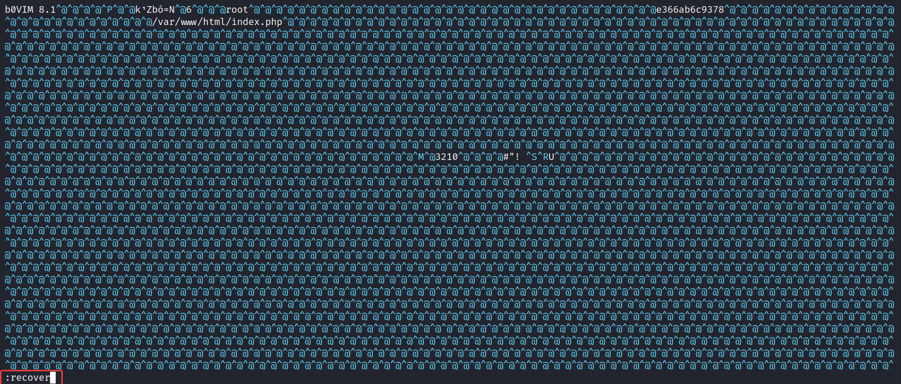

# Vim Hurts

**Author:** SecurityGOAT

## Category

Web

## Question

> Sysadmin like me love Vim! It's one of the beauties that never gets old. Its the part of the hacker culture, if you will.  
> I have configured a web server with secure file upload functionality. My friends say it might not be as secure as I think.  
> I cannot think of any good reason except that maybe I left some trace? Maybe its my poor Vim habit?  
> In case you are wondering, yeah, I still don't know how to exit out of Vim.  

## Hints

1. Vim creates swap files to store the recovery version of the file being edited.
2. The swap files can be used to *recover* the files.
3. Security is a *race* between attackers and defenders. Who would eventually win this *race*?

## Solution

Retrieve the *swp* file corresponding to **index.php**. This reveals the PHP code which has a Race condition. Once detected, upload a webshell indefinitely either using curl or Burp's NULL payload attacker in the Intruder tab. That would constantly push the uploaded file on the server. It is stored in the uploads directory (can be inferred from the code or by uploading a normal image). Next, we need to send request to find the flag and read it.  

### Detailed Solution

A file uploading web app is provided:  

Scan the files on web server using **dirb**:  

The **uploads** directory and the **index.php** file exist on the web server.  

The challenge name is revolving around vim. The admin doesn't knows how to exit vim. That could mean a swap file might be present on the server. If that is the case, we can read the PHP source code as well.  

Try to download the swap file corresponding to the **index.php** file:  

That worked! Open the swap file in vim:  

Recover the swap file:  

Read the contents of **index.php**:  

In the **check_file()** function, we have a potential race condition, provided that there are more checks or if this function take some time to return the results. An attacker can abuse this window to upload a webshell and execute it to obtain a reverse shell or simply run some shell commands.  

Using Burp Intruder to perform a NULL payload attack and uploading a PHP webshell:  

Find the flag location:  

Retrieve the flag:  

## Flag
STANDCON22{v!m_swp_f!l3s_c4n_s3rv3_4tt3ck3rs}

# Other Writeups
- https://dame-dango.github.io/STANDCON2022/Vim%20Hurts/